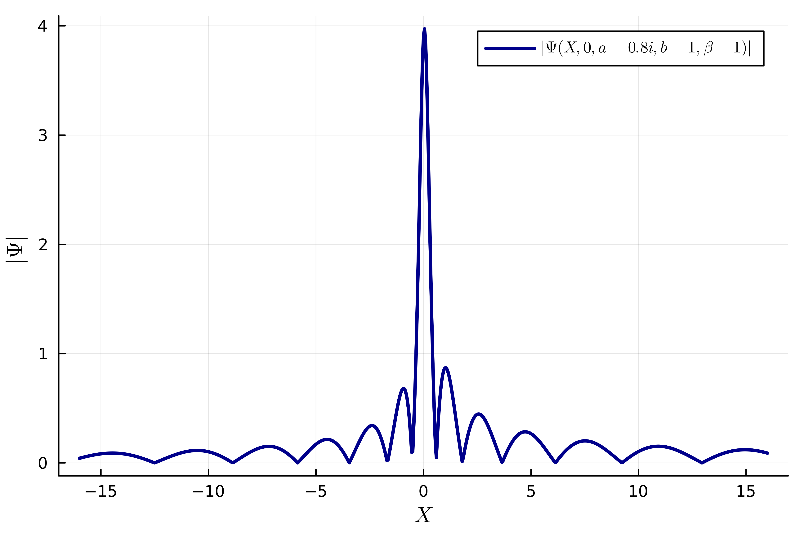

# RogueWaveInfiniteNLS.jl
Julia package for computing the rogue waves of infinite order for the focusing nonlinear Schrodinger equation.
This is a special solution of the focusing nonlinear equation denoted by $\Psi(X,T;\mathbf{G},\beta)$, whose exact and asymptotic properties (in different regimes where $(X,T)\in\mathbb{R}^2$ becomes large) were studied recently in the manuscript *Asymptotic properties of general rogue waves of infinite order* [Bilman&Miller, 2024].
This solution depends parametrically on a $2\times 2$ matrix $\mathbf{G}$ and a scalar $\beta>0$. The matrix $\mathbf{G}$ is given by 
```math
\mathbf{G}=\mathbf{G}(a,b)=\frac{1}{\sqrt{|a|^2+|b|^2}}\begin{bmatrix} a & b^* \\ -b & a^* \end{bmatrix},
```
 where $c^*$ denotes the complex conjugate of $c\in\mathbb{C}$.

The main routine is `psi`. The command
```code
psi(0.8, 1.2, 1, 2im, 1)
```
computes $\Psi(X,T;\mathbf{G},\beta)$ at $(X,T)=(0.8,1.2)$ with $a=1$ and $b=2i$, and scalar $\beta=1$. So the syntax for the end user is `psi(X, T, a, b, beta)`. 

$\Psi(X,T;\mathbf{G},\beta)$ is defined in terms of the solution of a Riemann-Hilbert problem that depends parametrically on the arguments $(X,T;\mathbf{G},\beta)$.
Depending on the location of $(X,T)$ in $\mathbb{R}^2$, a suitably regularized (deformed using the noncommutative steepest descent techniques) Riemann-Hilbert problem implemented as part of this package is picked automatically and it is solved numerically using [OperatorApproximation.jl](https://github.com/tomtrogdon/OperatorApproximation.jl/).

## A minimal example
One can compute the timeslice at $T=0$ in a parallelized manner via:
```code
using Distributed
addprocs()
using RogueWaveInfiniteNLS
@everywhere Xlist = collect(-16:0.05:16)
@everywhere atest = 0.8im
@everywhere btest = 1
@everywhere compute_psi_slice = X->psi(X,0,atest,btest,1)
outpsiX = pmap(compute_psi_slice, Xlist)
```

The variable `outpsiX` holds a vector of (complex) values of $\Psi(X,T=0,a=0.8i,b=1,\beta=1)$ for $-16\leq X \leq 16$ with a mesh-size of $dX=0.05$. Then one can plot, say, the absolute value of the computed solution via
```code
using Plots
using LaTeXStrings
abs_outpsiX = abs.(outpsiX)
plot(Xlist, abs_outpsiX, label=L"|\Psi(X,0,a=0.8i,b=1,\beta=1)|", xlabel=L"X", ylabel=L"|\Psi|", legend=:topright, linewidth=2.5, linecolor="darkblue")
```



